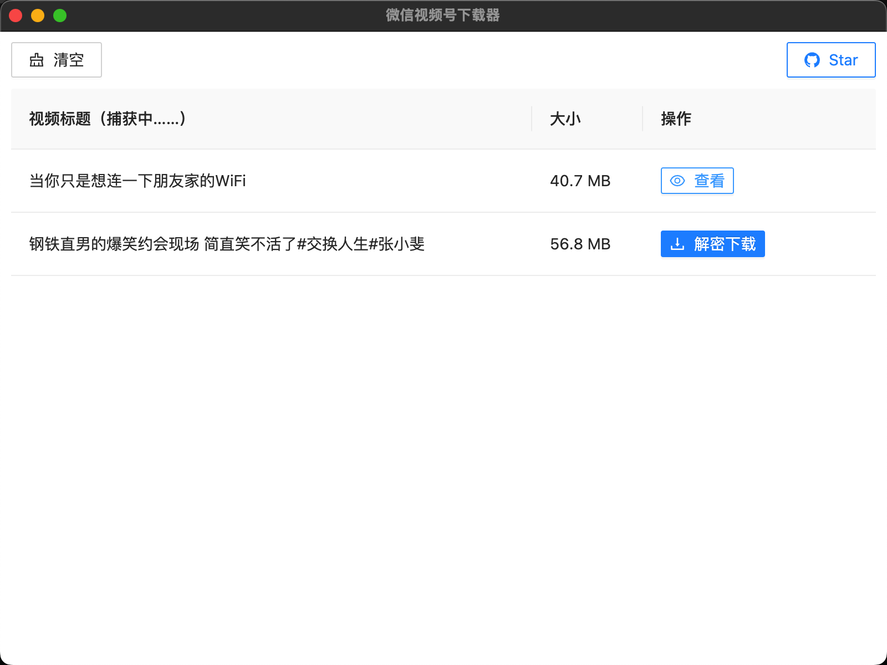
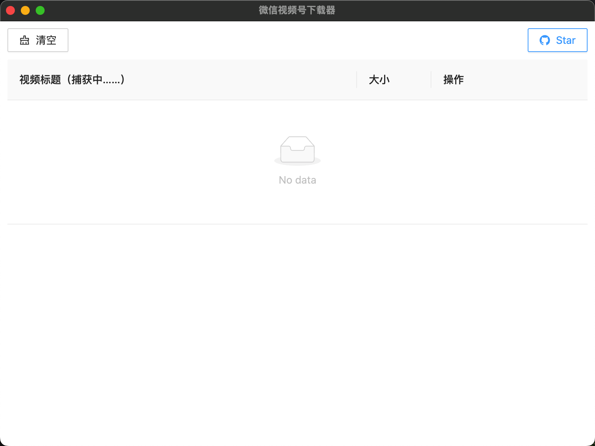
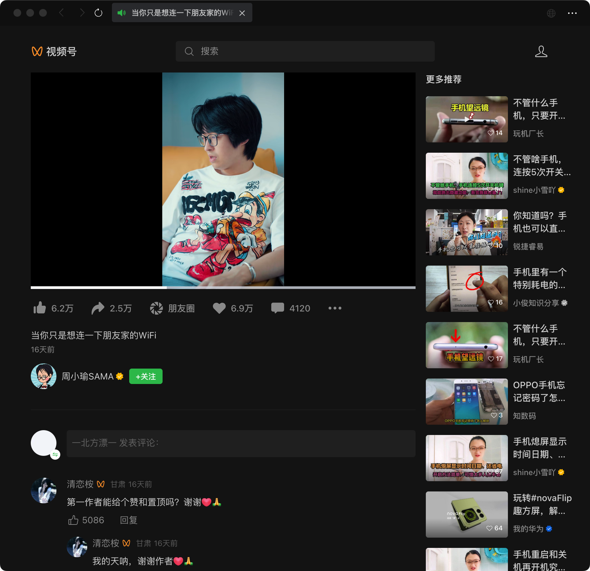
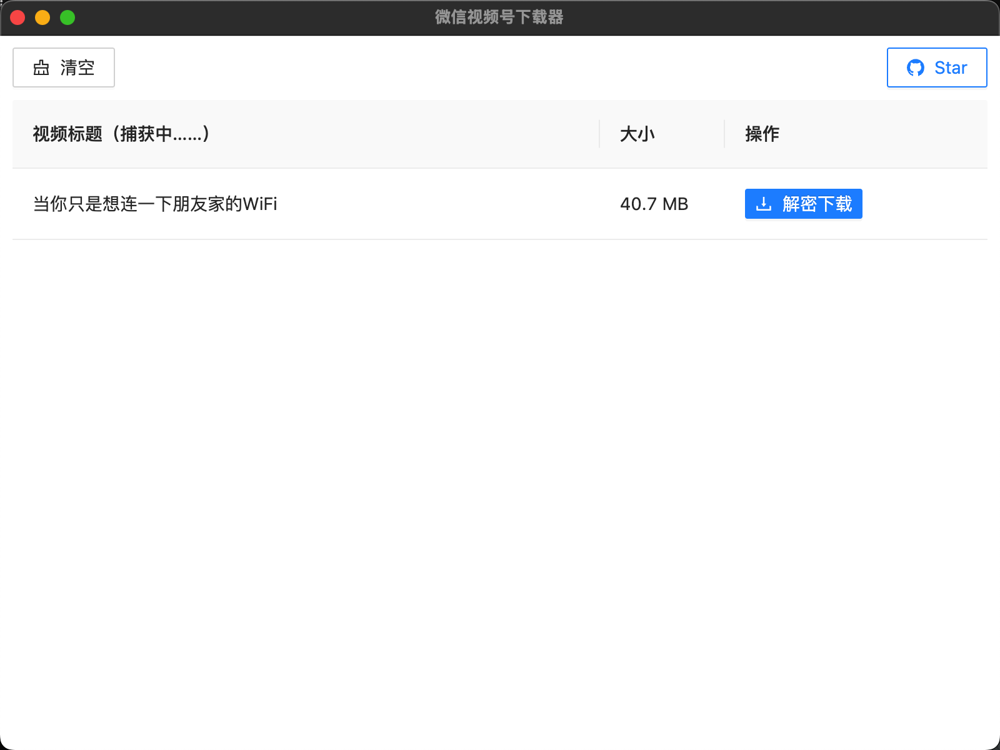
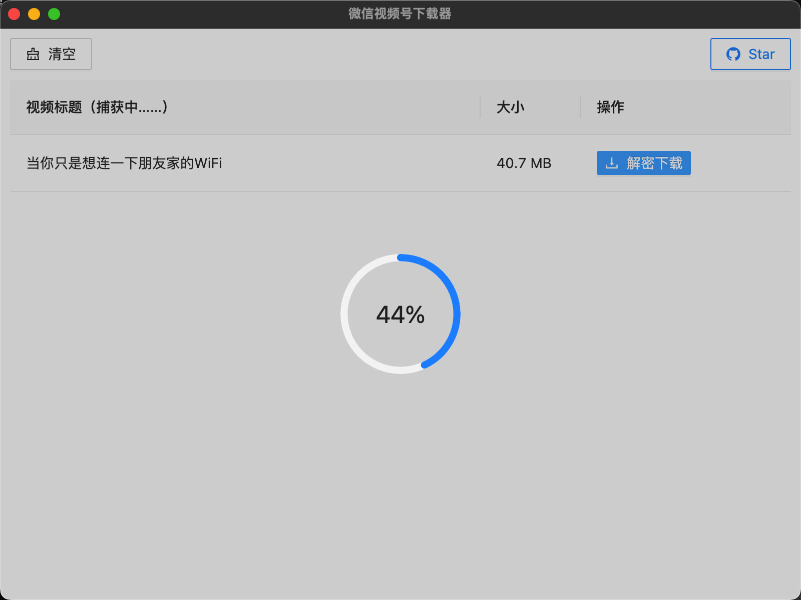
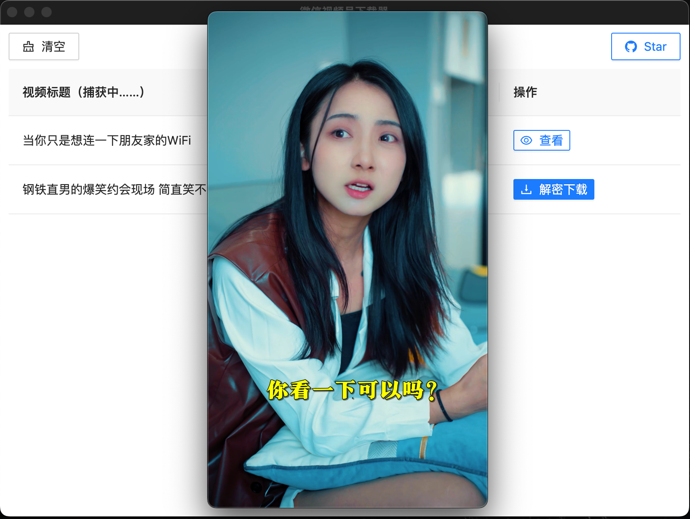

# 微信视频号下载器

> 🔥🔥🔥 V2.x版本支持加密视频的下载，可到 Release 中下载更新。


- 支持实时捕获视频号的视频地址
- 捕获后，可进行预览和下载
- 支持 Win/Mac




> 内部采用代理拦截请求识别，所以本软件需要安装证书及自动开启代理（当然这些都是自动执行的，无需手动操作）。关闭此软件时会自动清除代理信息，不影响使用。


### 下载

请到 Release 中进行下载：https://github.com/xiaofu666/WeChatVideoDownloader/releases

---

### 效果

1. 运行本软件


 
2. 打开视频号的视频进行播放，如下图视频：



3. 本软件会自动捕获到该视频



4. 点击 “解密下载” 按钮进行下载



4. 点击 “查看” 可播放已下载的视频



---
### 使用

1. 首次打开需要进行初始化，此过程会进行证书安装：


2. 点击 “是”，安装后，就可以正常使用了：


#### Mac 系统处理

由于新 Mac OS 不支持非交互式执行 sudo 命令，所以本软件初始化时会自动将命令复制到剪切板，你只需要打开 “终端”，粘贴一下就可以了，然后回车执行，效果如下图所示：


---

### 本地编译

安装 node, yarn
```
brew install node
brew install yarn
```

启动
```
yarn add concurrently --dev
yarn start
```

### 打包应用
```
npm run pack
```


### FAQ:

问：无法抓包？

答：确保以下三个条件都满足：
1、确保VPN关闭（因为此软件也是设置代理，会冲突）
2、确保没开代理（因为此软件也是设置代理，会冲突）
3、缓存的问题(会影响 javascript 脚本注入 polyfills.publishxxx.js)：
* windows下清除 C:\Users\<user>\AppData\Roaming\Tencent\WeChat\radium\web\profiles\*
* macOS 下清除 ~/Library/Containers/com.tencent.xinWeChat/Data/.wxapplet/web/profiles/multitab*
然后重启软件，点击视频号链接，就会捕捉到了

